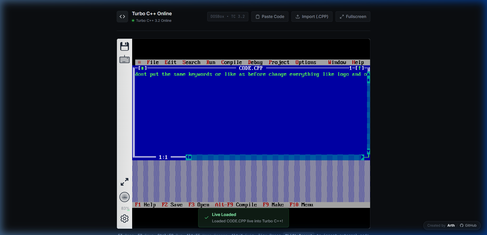
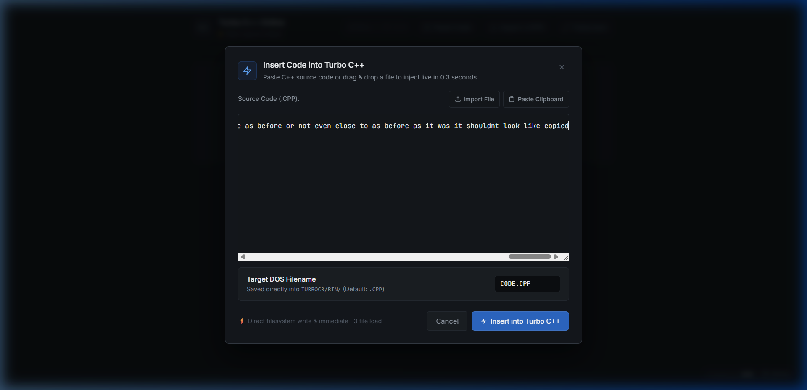
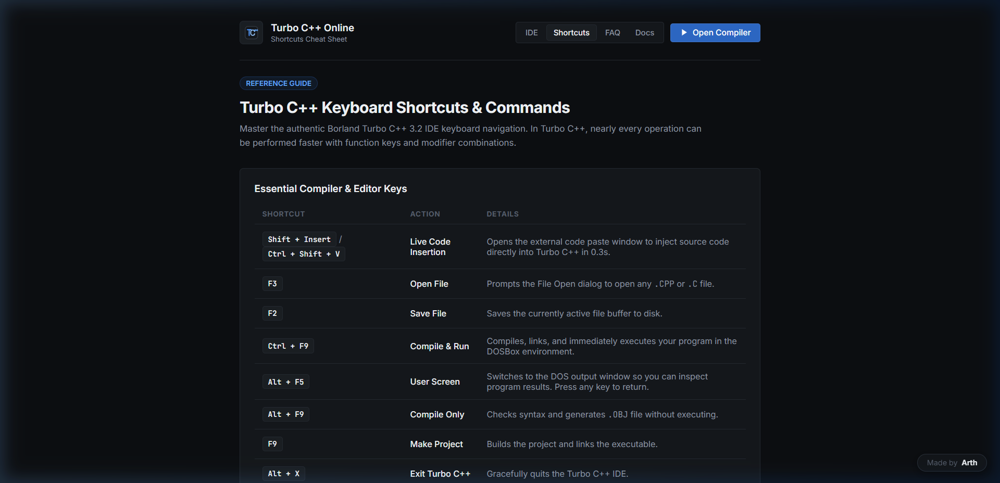
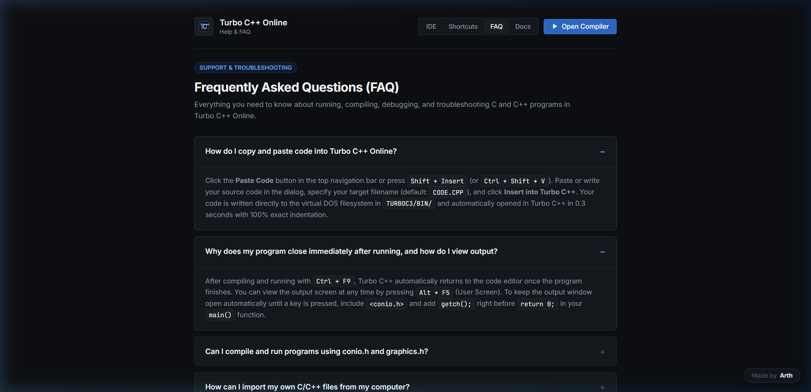

# Turbo C++ Online (TurboC-Online_)

<div align="center">
  
  <br>
  <h3>Run Authentic Borland Turbo C & C++ 3.2 in Your Browser</h3>
  <p>100% Ad-Free • 0.3s Live Code Injection • Native File Import • WebAssembly DOSBox • Offline PWA Support</p>

  <p>
    <a href="https://turbocplus.vercel.app/"></a>
    
    
    
  </p>
</div>

---

## 📸 Screenshots & Previews

### 🖥️ 1. Turbo C++ 3.2 IDE Workspace
> Clean, distraction-free compiler environment running authentic Borland Turbo C++ 3.2 inside high-performance WebAssembly DOSBox.

<div align="center">
  
</div>

<br>

### ⚡ 2. 0.3s Live Code Injection Dialog
> Bypasses slow DOS keyboard buffers. Pasted code is written directly to the virtual DOS filesystem (`TURBOC3/BIN/CODE.CPP`) and opened in 300ms.

<div align="center">
  
</div>

<br>

### 📚 3. Dedicated Knowledge & Reference Pages
| Keyboard Shortcuts Reference | Interactive Frequently Asked Questions (FAQ) |
|:---:|:---:|
|  |  |
| **`shortcuts.html`** — Full keyboard reference | **`faq.html`** — Output screen, copy/paste, `conio.h` guides |

---

## 🌟 Key Features

- ⚡ **0.3s Live Code Injection**: Insert external code live into Turbo C++ in **0.3 seconds** with 100% exact indentation and formatting, bypassing slow keyboard buffer simulations.
- 📁 **Native File Import**: Import `.cpp`, `.c`, `.h`, `.hpp` files from your computer via the toolbar button or by dragging and dropping them into the editor.
- 🔤 **C++ by Default (`.CPP`)**: Defaults to `.CPP` file extensions and includes a clean modern C++ starter template.
- 🖱️ **Unrestricted Mouse Navigation**: Pointer lock is disabled, allowing free mouse movement between Turbo C++ top menus (`File`, `Edit`, `Compile`, `Run`) and other browser windows.
- 📋 **Universal Shortcuts**: Press `Shift+Insert` or `Ctrl+Shift+V` anywhere on the page to immediately open the code insertion modal.
- 🛡️ **Completely Ad-Free**: Zero banner ads, zero popups, zero popunders, and zero third-party tracking scripts.
- 📱 **Progressive Web App (PWA)**: Installable on desktop and mobile with offline caching via Service Worker.
- 🤖 **AI Search & Semantic Web**: Includes `robots.txt`, `llms.txt`, `ai.md`, and rich JSON-LD `FAQPage` + `WebApplication` schemas.

---

## 📂 Multi-Page Architecture

| Page | Path | Purpose |
|---|---|---|
| **IDE** | [`index.html`](index.html) | Pure compiler workspace with DOSBox canvas and quick actions |
| **Shortcuts** | [`shortcuts.html`](shortcuts.html) | Comprehensive keyboard shortcuts reference table with `<kbd>` key badges |
| **FAQ** | [`faq.html`](faq.html) | Solutions for viewing output (`getch()`), `conio.h`, `graphics.h`, and Windows 11 64-bit |
| **Docs** | [`docs.html`](docs.html) | WebAssembly DOSBox architecture guide and virtual filesystem specifications |

---

## 💻 Run Locally

```bash
# Clone the repository
git clone https://github.com/ArthOfficial/TurboC-Online_.git
cd TurboC-Online_

# Serve with Node.js
npx serve .

# Or serve with Python
python -m http.server 8080
```

Open `http://localhost:8080` in your browser.

---

## ⌨️ Useful Shortcuts

| Shortcut | Action |
|---|---|
| `Shift + Insert` / `Ctrl + Shift + V` | Open Paste & Live Code Insertion Modal |
| `F3` | Open file in Turbo C++ |
| `F2` | Save current file in Turbo C++ |
| `Ctrl + F9` | Compile and Run program |
| `Alt + F5` | View User Output Screen |
| `Alt + F9` | Compile Only (Syntax Check) |
| `Alt + X` | Exit Turbo C++ |
| `F11` | Toggle Fullscreen (Full Big Scaling) |
| `Esc` | Close dialog or exit Fullscreen |

---

## 📄 License & Credits

- **Author & Maintainer**: Created and maintained by **[Arth](https://github.com/ArthOfficial)**.
- **Turbo C++ 3.2**: Copyright © Borland Software Corporation. Provided for educational and non-commercial archival use.
- **JS-DOS**: Powered by [js-dos.com](https://js-dos.com/) (DOSBox via WebAssembly).

